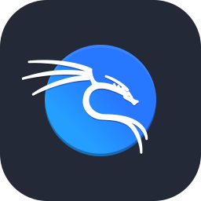

    

  <h1>
    Hi!
    I'm Andrés López
    
  </h1>

  

<h3 align="left">About Me:</h3>

+4 years of experience in the field of design and development. During my career I have had the opportunity to work on a variety of individual and team projects, using new technologies and tools to solve complex problems. I am dedicated to applying my design and development skills to create innovative solutions that meet the needs of users.

- 👋 Hi, I’m Andrés Eloy López Mejías
- 📚 I’m currently learning Associate Degree in Cybersecurity at [Universidad del Gran Rosario](https://ugr.edu.ar/carreras/tecnicatura-universitaria-en-ciberseguridad/)	
- 📍 I currently live in Buenos Aires, Argentina
- ⚡ Fun fact: I'm obsessed with coding and hacking
- 📫 How to reach me: Mail me at "andreselm.dev@gmail.com"

<h3 align="left">Languages and Tools:</h3>

                          

<h3 align="left">Contacts:</h3>

  

